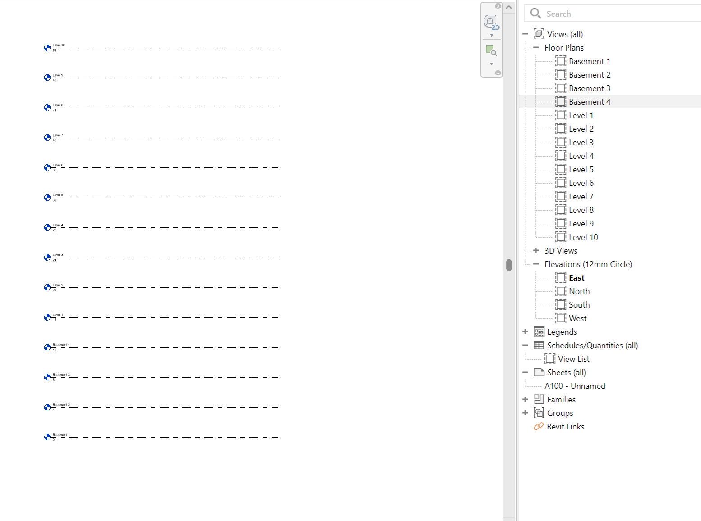

# 🏗️ Script: Creation of Levels and Floor Plans

## 📘 Description
This Dynamo script automates the creation of levels(For Basements and Levels) and corresponding floor plans in Revit.  
It helps quickly set up project templates by eliminating the need to create each level and floor plan manually.

---

## ⚙️ Tested Environment
- Autodesk Revit 2024  
- Dynamo (Bundled with Revit 2024)

> ⚠️ The script was tested in Revit 2024. It may also work in other versions, but compatibility has not been verified.

---

## 🔢 Inputs
- No of Basements 
- Basements  Spacing (in m)  
- No of Levels
- Levels Spacing (in m)  
- Yes/No to create floor plans for Basements
- Yes/No to create floor plans for the Levels

---

## 📤 Outputs
- New Revit Levels  
- Corresponding Floor Plan Views  

---

## 🖼️ Preview

---

## ✍️ Author
Developed by [Durga Bhavani Yasarapu](https://www.linkedin.com/in/durgabhavaniyasarapu/)
