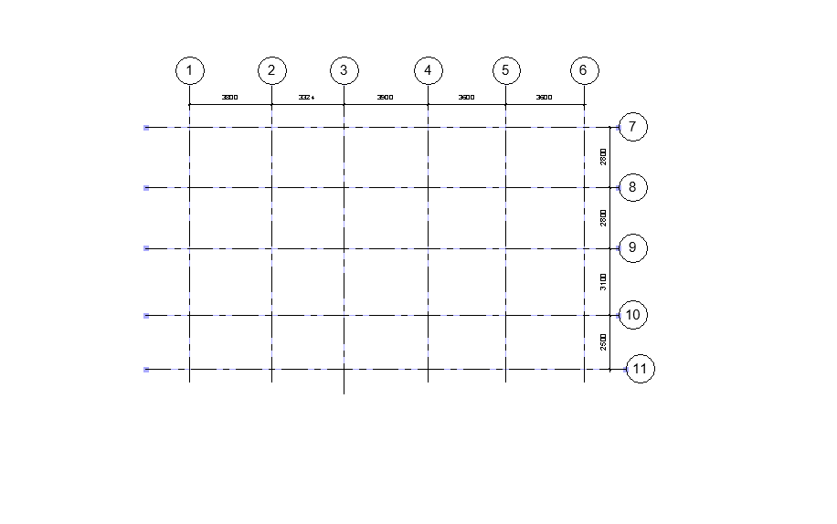

# 📏 Script: Grid Dimensioning

## 📘 Description
This Dynamo script automates the process of creating dimensions between Revit grid lines in a selected view.  
It eliminates the need to manually select each grid line and place dimensions, significantly reducing time during sheet setup or coordination phases.

---

## ⚙️ Tested Environment
- Autodesk Revit 2024  
- Dynamo (Bundled with Revit 2024)

> ⚠️ The script was tested in Revit 2024. It may also work in other versions, but compatibility has not been verified.

---

## 🔢 Inputs
- Need to select the View Name

---

## 📤 Outputs
- Linear grid dimensions automatically placed in the specified view both in X sand Y directions.  

---

## 🖼️ Preview

---

## ✍️ Author
Developed by [Durga Bhavani Yasarapu](https://www.linkedin.com/in/durgabhavaniyasarapu/)
