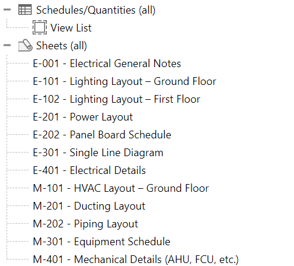

# 📏 Script: Sheets Creation

## 📘 Description
This Dynamo script automates the creation of multiple Revit sheets from an Excel file.
By simply providing the Sheet Name and Sheet Number in Excel, the script generates all the corresponding sheets inside the Revit project automatically.

---

## ⚙️ Tested Environment
- Autodesk Revit 2025
- Dynamo (Bundled with Revit 2025)

> ⚠️ The script was tested in Revit 2025. It may also work in other versions, but compatibility has not been verified.

---

## 🔢 Inputs
- Excel File Path: Path to the Excel file containing sheet data.
- Sheet Number Column: First Column containing the numbers for each sheet.
- Sheet Name Column: Second Column containing the names of sheets to be created.
- Enter the sheet Name of the Excel.
- Select the Title block for the Sheets creation.

---

## 📤 Outputs
- Creates new sheets in Revit based on the provided Excel data (Sheet Name + Sheet Number).  

---

## 🖼️ Preview

---

## ✍️ Author
Developed by [Durga Bhavani Yasarapu](https://www.linkedin.com/in/durgabhavaniyasarapu/)
