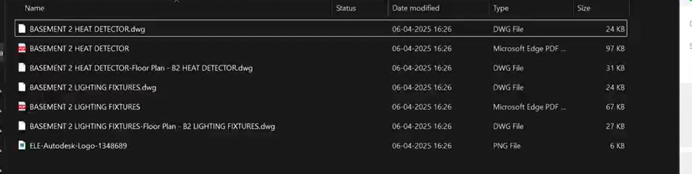

# 📏 Script: PDF & CAD Export

## 📘 Description
This Dynamo script automates the process of exporting multiple Revit sheets to both PDF and CAD formats in a single run.

---

## ⚙️ Tested Environment
- Autodesk Revit 2023
- Dynamo (Bundled with Revit 2023)

> ⚠️ The script was tested in Revit 2023. It may also work in other versions, but compatibility has not been verified.

---

## 🔢 Inputs
- Select the sheets which you want to export.
- Provide the path for exports.
- Yes/No export the sheet into CAD.
- Yes/No export the sheet into PDF.

---

## 📤 Outputs
- Exports selected sheets as PDF files and/or CAD files to the specified folder.  

---

## 🖼️ Preview

---

## ✍️ Author
Developed by [Durga Bhavani Yasarapu](https://www.linkedin.com/in/durgabhavaniyasarapu/)
